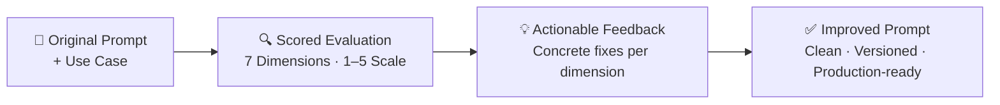

# PromptLint

A linter for LLM prompts. Scores your prompt across 7 dimensions, flags technique gaps for your use case, and generates an improved version.

PromptLint is a [Claude Code plugin](https://docs.claude.com) that evaluates prompts the way a code linter evaluates code — against a rubric of best practices, tuned to what actually matters for *your* use case.

## What it does

Run `/promptlint` on any LLM prompt and get:

1. **A scored evaluation** across 7 dimensions (1–5 scale each)
2. **Actionable feedback** with concrete fixes for every weak area
3. **An improved prompt** that's clean and production-ready — copy it straight into your codebase

### How It Works



### The 7 Evaluation Dimensions

> Each dimension is scored on a **1–5 scale**. A 5 means genuinely excellent — most production prompts score 2–4, and the value is in the specific, actionable feedback.

#### 1. Clarity & Specificity
> *Could a "brilliant new employee" with zero context follow this perfectly?*

| 1/5 | 5/5 |
|-----|-----|
| Fundamentally unclear what the prompt wants | Crystal clear — zero-context colleague could follow it flawlessly |

- Action-oriented instructions ("Do X" instead of "Don't do Y")
- Explicit constraints and sequential steps with clear ordering

#### 2. Context & Motivation
> *Explain the **why**, not just the **what**, to help the model generalize.*

| 1/5 | 5/5 |
|-----|-----|
| No context — just raw, bare instructions | Rich context that enables intelligent generalization |

- Background info on the task's purpose or target audience
- Motivated constraints so the model handles unstated edge cases intelligently

#### 3. Structure & Organization
> *Use structural elements like XML tags to prevent model misinterpretation.*

| 1/5 | 5/5 |
|-----|-----|
| No structural organization — a wall of text | Well-structured with clear tags, hierarchy, and separation of concerns |

- XML tags to separate instructions, context, examples, and data
- Consistent nesting hierarchy and clear section boundaries

#### 4. Examples & Few-Shot Quality
> *Provide diverse, realistic demonstrations to ground the model's output.*

| 1/5 | 5/5 |
|-----|-----|
| No examples where they would clearly help | 3+ diverse, realistic, well-structured examples covering edge cases |

- 3–5 diverse examples covering typical and edge cases, wrapped in `<example>` tags
- Balanced across categories/labels — scored N/A when examples aren't needed

#### 5. Output Contract
> *Define exactly what "done" looks like.*

| 1/5 | 5/5 |
|-----|-----|
| No output specification at all | Complete spec — format, fields, tone, length, and fallback behaviors |

- Expected format (JSON, Markdown, prose), length, and tone
- Edge case handling and fallback behavior specification

#### 6. Technique Fitness
> *Leverage the right prompting patterns tailored to your specific use case.*

| 1/5 | 5/5 |
|-----|-----|
| No awareness of prompting techniques — bare instruction | Excellent pattern selection precisely matched to the use case |

- Aligns techniques with use cases (Chain-of-Thought for reasoning, ReAct for agents, etc.)
- Structured output and balanced labels for classification tasks

#### 7. Robustness & Edge Cases
> *Defend against adversarial inputs, ambiguity, and failure modes.*

| 1/5 | 5/5 |
|-----|-----|
| No consideration of robustness or failure modes | Comprehensive defense against adversarial input and uncertainty |

- Separation of instructions from user data (prompt injection defense)
- Hallucination guardrails and instructions for handling missing information

---

### Use-Case-Aware Evaluation

PromptLint adjusts its rubric based on the **Technique Fitness** required for your project:

| Use Case | What PromptLint Checks |
|----------|----------------------|
| **Classification** | Label definitions, structured output, balanced examples |
| **Agentic** | ReAct pattern, tool definitions, state management, safety rails |
| **RAG** | Grounding, source attribution, context tagging |
| **Code Generation** | Schema definitions, language/framework specification |
| **Reasoning** | Chain-of-thought, step-by-step decomposition |

### Source Fidelity Sub-Rubric

> Activated for **multi-source RAG systems** — code intelligence, Jira + Slack + PDF pipelines, hybrid graph agents, legal citation systems.

| Check | What It Enforces |
|-------|-----------------|
| **Per-Type Fidelity** | Code → character-exact; Jira → field IDs preserved; Slack → speaker attribution; Legal → verbatim quotes |
| **Context Tagging** | Sources wrapped in typed tags (`<source type="code">`, `<source type="jira">`, etc.) |
| **Conflict Resolution** | Explicit instructions when sources disagree (e.g., Slack says "broken" vs Jira says "resolved") |
| **Traceability** | Mandatory citations — file paths, ticket IDs, channel + timestamp, page + section |

## Installation

### One-command install (recommended)

```bash
npx @ceoepicwise/promptlint
```

This installs the plugin into your Claude Code environment. Restart Claude Code and `/promptlint` is ready to use.

To uninstall:

```bash
npx @ceoepicwise/promptlint --uninstall
```

### Manual install

```bash
# Clone the repo
git clone https://github.com/EpicWise/promptlint.git

# Run Claude Code with the plugin loaded
claude --plugin-dir ./promptlint
```

## Usage

```
/promptlint ./prompts/system-prompt.md Customer support chatbot handling refunds

/promptlint ./src/rag-prompt.txt Hybrid code intelligence assistant with Jira and Slack context

/promptlint paste Classification pipeline for routing support tickets
```

**First argument:** file path to the prompt, or `paste` to paste it inline.

**Remaining arguments:** the use case — what the prompt does, who it's for, and any constraints the linter should know.

## Output

Every lint run produces two timestamped files:

```
system_prompt.md                              ← your original (untouched)
system_prompt_lint_20260323_143052.md          ← evaluation report
system_prompt_improved_20260323_143052.md      ← improved prompt
```

Run the linter again after making changes and the previous results are preserved — making it easy to diff across iterations and track how your prompt evolved.

## Scoring

Scoring is strict by design. A 5/5 means genuinely excellent. Most production prompts score 2–4 on most dimensions, and that's normal — the value is in the specific, actionable feedback.

## Project Structure

```
promptlint/
├── .claude-plugin/
│   └── plugin.json          # Plugin metadata
├── bin/
│   └── install.mjs          # npx installer
├── commands/
│   └── lint.md              # /promptlint slash command
├── skills/
│   └── evaluate-prompt/
│       ├── SKILL.md          # Core evaluation engine
│       └── references/
│           └── techniques.md # Technique-to-use-case mapping
├── evals/
│   ├── evals.json           # Test cases with expected outcomes
│   └── test-prompts/        # Sample prompts for testing
├── package.json             # npm package config
├── LICENSE                   # MIT
├── CONTRIBUTING.md
└── README.md
```

## Contributing

Contributions are welcome — see [CONTRIBUTING.md](CONTRIBUTING.md) for details. Areas where help is especially valuable:

- **New technique references** — know a prompting pattern that should be part of the evaluation? Add it.
- **New test cases** — prompts from healthcare, legal, finance, devtools, and other domains.
- **Use-case-specific sub-rubrics** — similar to the Source Fidelity Sub-Rubric, other domains may benefit from specialized checks.
- **Model-specific guidance** — deep experience with a model's prompting quirks? Add model-aware checks.

## Roadmap

- **v1.0** (current) — Prompt evaluation and improvement
- **v1.1** — Prompt generation from a use case description (`/promptlint generate`)

## License

[MIT](LICENSE) — Copyright 2026 EpicWise
